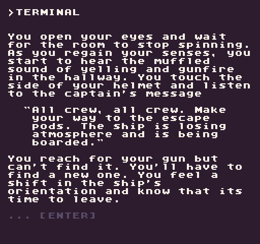
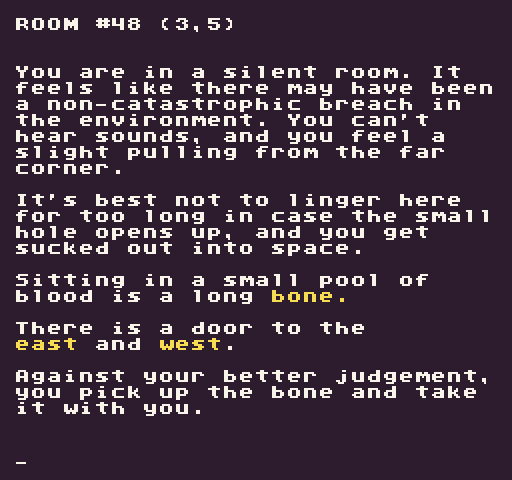
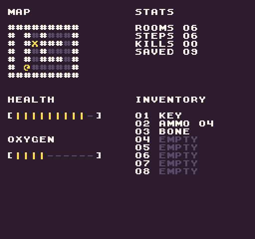

# Terminal Manual

To add members to a team, you first need to add them as friends. Visit each others user pages and click the  Follow button to become friends. When you are done, return here and you will be able to add them to your team.
Description
You open your eyes and wait for the room to stop spinning. As you regain your senses, you start to hear the muffled sound of yelling and gunfire in the hallway. You touch the side of your helmet and listen to the captain's message.

"All crew, all crew. Make your way to the escape pods. The ship is losing atmosphere and is being boarded."

You reach for your gun but can't find it. You'll have to find a new one. You feel a shift in the ship's orientation and know that its time to leave.

Your job is to keep all the people onboard alive by finding them and leaving on one of the escape pods.

To do this, you'll have to use your wits and some action words like **look**, **use**, **take**, and **go**. If you ever get stuck, type help to see your options.

### Instructions

The goal of the game is to save as many people as you can while exploring the ship, fighting off aliens, and making your way to the escape pod. While you move around the ship, your oxygen level will begin to deplete. If you run out of air, you will instantly die.

To accomplish your mission, you can perform actions by typing them at the bottom of the screen when the input field begins blinking. Hitting enter will submit the action, and you'll get a message back if it was successful or not. 

The up and down arrows allow you to go back through your action history.

Typing help at the point will display actions you can perform on that screen.

### Actions

You can enter the following actions at the bottom of the screen. To perform an action, hit enter.

| Action | Target | Description |
|---|---|---|
| `look` | [around] | Display room description text. |
| `at` |[item] | Display details of an item in the room or your inventory. |
| `go`  | [direction]  | You can move [north], [east], [south], or [west].  |
| `help` |   | Displays any actions you can do on the screen.  |
| `start` |   | Begins a new game.  |
| `take`  | [item]  | Puts an item from the room into your inventory.  |
| `use` | [item]  | Use an item in your inventory.  |
| `map` |   | Open the map and see your inventory and stats |

* Hitting the enter key will skip the text animation and go to the next page of text.

### Items

These are some of the items you'll find while you explore the ship.

| Item| Amount| Description |
|---|---|---|
| [ammo]  | 4  | Used by all guns.  |
| [health] | 1  | Restores all your health.  |
| [key]  | 1  | Opens the airlock.  |
| [pistol]  | 1  | A standard-issue hand pistol.  |
| [smg]  | 1  | A sub-machine gun designed to shoot multiple bullets.  |

### Combat

Along the way, you'll find Aliens that will attack you. Some might take you by surprise and attack first. Others will wait for you to attack. Simply use any of your guns, assuming you have enough ammo to shoot them.

After attacking an Alien, it will retaliate. You can also avoid fighting Aliens by moving to the next room, but beware they may attack you on the way out.

If your health reaches 0, you will instantly die.

### Screenshots

